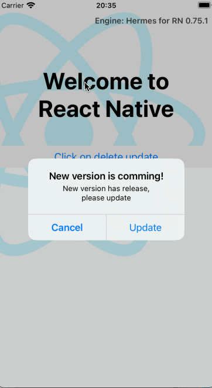

# Hot Update via Server

A React Native module that enables you to manage hot updates similar to CodePush but with less configuration. With this library, you can take full control of version management and host the JavaScript bundle yourself. This library focuses on installing the hot update after the bundle is downloaded from your server. Since CodePush is retiring soon, this library provides an alternative for managing bundle updates on your backend.

iOS GIF             | Android GIF
:-------------------------:|:-------------------------:
 | 


## Guidelines for Managing the Bundle

This guide demonstrates how to manage the JavaScript bundle yourself. In this example, Firebase Storage is used to host the bundle and a JSON file to announce new versions:

### 1. Add Scripts to Your `package.json` to Export the JavaScript Bundle and Source Map Files

#### For React Native CLI:
```json
"scripts": {
"export-android": "mkdir -p android/output && react-native bundle --platform android --dev false --entry-file index.js --bundle-output android/output/index.android.bundle --assets-dest android/output --sourcemap-output android/sourcemap.js && cd android && find output -type f | zip index.android.bundle.zip -@ && zip sourcemap.zip sourcemap.js && cd .. && rm -rf android/output && rm -rf android/sourcemap.js",
"export-ios": "mkdir -p ios/output && react-native bundle --platform ios --dev false --entry-file index.js --bundle-output ios/output/main.jsbundle --assets-dest ios/output --sourcemap-output ios/sourcemap.js && cd ios && find output -type f | zip main.jsbundle.zip -@ && zip sourcemap.zip sourcemap.js && cd .. && rm -rf ios/output && rm -rf ios/sourcemap.js"
}
```

#### For Expo/Expo Bare Projects:
```json
"scripts": {
"export-android": "mkdir -p android/output && npx expo export:embed --platform android --entry-file node_modules/expo/AppEntry.js --bundle-output android/output/index.android.bundle --dev false --assets-dest android/output --sourcemap-output android/sourcemap.js && cd android && find output -type f | zip index.android.bundle.zip -@ && zip sourcemap.zip sourcemap.js && cd .. && rm -rf android/output && rm -rf android/sourcemap.js",
"export-ios": "mkdir -p ios/output && npx expo export:embed --platform ios --entry-file node_modules/expo/AppEntry.js --bundle-output ios/output/main.jsbundle --dev false --assets-dest ios/output --sourcemap-output ios/sourcemap.js && cd ios && find output -type f | zip main.jsbundle.zip -@ && zip sourcemap.zip sourcemap.js && cd .. && rm -rf ios/output && rm -rf ios/sourcemap.js"
}
```
> **Note:** For Expo projects, verify the path of `--entry-file node_modules/expo/AppEntry.js` in your `package.json`.


#### For Hermes compiler bundle to bytecode .hbc:

Use this will make start up at runtime more faster than bundlejs, need enable engine Hermes
```json
"scripts": {
"export-bytecode-android": "mkdir -p dist/android && npx expo export:embed --platform android --minify=true --entry-file index.tsx --bundle-output dist/android/index.android.bundle --dev false  --assets-dest dist/android && ./node_modules/react-native/sdks/hermesc/linux64-bin/hermesc -emit-binary -out dist/android/index.android.hbc.bundle dist/android/index.android.bundle -output-source-map -w && rm -f dist/android/index.android.bundle dist/android/index.android.hbc.bundle.map && cd dist && find android -type f | zip hermes.android.hbc.zip -@ && cd .. && rm -rf dist/android",
"export-bytecode-ios": "mkdir -p dist/ios && npx expo export:embed --platform ios --minify=true --entry-file index.tsx --bundle-output dist/ios/main.jsbundle --dev false --assets-dest dist/ios && ./node_modules/react-native/sdks/hermesc/linux64-bin/hermesc -emit-binary -out dist/ios/main.ios.hbc.jsbundle dist/ios/main.jsbundle -output-source-map -w && rm -f dist/ios/main.jsbundle dist/ios/main.ios.hbc.jsbundle.map && cd dist && find ios -type f | zip hermes.ios.hbc.zip -@ && cd .. && rm -rf dist/ios"
}
```
> **Note:** This Hermes compiler for expo bare project, for CLI change expo export:embed to react-native bundle. For Hermes runner, need check version of os and change the folder `node_modules/react-native/sdks/hermesc/linux64-bin/hermesc`, change linux64-bin to os/win to make it suitable for your OS


#### For window script:

```json
"scripts": {
"export-android": "mkdir android\\output && react-native bundle --platform android --dev false --entry-file index.js --bundle-output android\\output\\index.android.bundle --assets-dest android\\output --sourcemap-output android\\sourcemap.js && cd android && powershell -Command \"Compress-Archive -Path output -DestinationPath index.android.bundle.zip\" && powershell -Command \"Compress-Archive -Path ..\\android\\sourcemap.js -DestinationPath sourcemap.zip\" && cd .. && rmdir /s /q android\\output && del android\\sourcemap.js",
"export-ios": "mkdir ios\\output && react-native bundle --platform ios --dev false --entry-file index.js --bundle-output ios\\output\\main.jsbundle --assets-dest ios\\output --sourcemap-output ios\\sourcemap.js && cd ios && powershell -Command \"Compress-Archive -Path output -DestinationPath main.jsbundle.zip\" && powershell -Command \"Compress-Archive -Path ..\\ios\\sourcemap.js -DestinationPath sourcemap.zip\" && cd .. && rmdir /s /q ios\\output && del ios\\sourcemap.js"
}
```

These scripts export the bundle and source map files, then compress them into a zip file (one for Android and one for iOS). You can customize these scripts to automate uploading to your server. Source map files can be ignored or used for debugging in release mode.

```json
Make sure zip file structure will be like this, should inside a parent folder:

bundle.zip
└── folder_name
    ├── index.android.bundle
    └── assets
        ├── xxx.png
        ├── xxxx.jpg
        ├── fonts
        │   ├── xxx.ttf
        │   └── xxx.ttf
        └── images
            ├── xxx
            └── xxx

```


### 2. Create an `update.json` File

The `update.json` file should look like this:
```json
{
  "version": 1,
  "downloadAndroidUrl": "https://firebasestorage.googleapis.com/v0/b/ota-demo-68f38.appspot.com/o/index.android.bundle.zip?alt=media",
  "downloadIosUrl": "https://firebasestorage.googleapis.com/v0/b/ota-demo-68f38.appspot.com/o/main.jsbundle.zip?alt=media"
}
```

Upload your bundle files and `update.json` to Firebase Storage. The structure will look like this:


### 3. Fetch the Update and Apply It

After setting up your version management, fetch the `update.json` file to get the download URL and call the following function:

```javascript
import hotUpdate from 'react-native-ota-hot-update';
import ReactNativeBlobUtil from 'react-native-blob-util';

hotUpdate.downloadBundleUri(ReactNativeBlobUtil, url, version, {
  updateSuccess: () => {
    console.log('Update successful!');
  },
  updateFail: (message) => {
    Alert.alert('Update failed!', message, [
      {
        text: 'Cancel',
        onPress: () => console.log('Cancel Pressed'),
        style: 'cancel',
      },
    ]);
  },
  restartAfterInstall: true,
  maxBundleVersions: 5, // Optional: Keep up to 5 versions (default: 2)
  metadata: { // Optional: Store metadata with the bundle
    description: 'New feature release',
    releaseNotes: 'Added new UI components',
  },
});
```

> **Important:** Always pass the `version` parameter in `downloadBundleUri`. This library caches the version and uses it to check for updates in the future. The default `version` is **0**.

> **Note:** You can use either `react-native-blob-util` or `rn-fetch-blob` as the `DownloadManager`, but **do not install both libraries at the same time**. Installing both will cause a duplicate symbol error on iOS.

> **Bundle Version Management:** By default, the library stores 2 bundle versions for rollback purposes. You can configure this using the `maxBundleVersions` option. When the number of stored bundles exceeds this limit, older bundles are automatically deleted. Each bundle is stored in a folder named with the format: `output_v{version}_{yyyy_MM_dd_HH_mm}`.

---

## Tips for Managing Bundles

In this demo, Firebase Storage is used to manage bundles and versions. While effective, a CMS might be more efficient.

For example, using Strapi CMS allows you to:
- Control versions easily.
- Automate releases with CI/CD pipelines.

Here are some screenshots of Strapi CMS:


Other CMS options include CraftCMS and PayloadCMS.

> Check the `sampleComponent` folder for logic related to CMS updates and scripts for auto-uploading bundles. For implementation support (service fee required), feel free to contact me via email.

---

## Library Functions

| Function                 | Return Type | Description                                                                                           | Parameters                                                                                     |
|--------------------------|-------------|-------------------------------------------------------------------------------------------------------|------------------------------------------------------------------------------------------------|
| `downloadBundleUri`      | `void`      | Downloads and installs the bundle.                                                                    | `(downloadManager: DownloadManager, uri: string, version: number, option?: UpdateOption)`     |
| `setupBundlePath`        | `boolean`   | Installs the bundle from a custom path. Ignore if using `downloadBundleUri`.                          | `path: string` - Path of the zip file containing the bundle.                                  |
| `setupExactBundlePath`   | `boolean`   | Installs the bundle from an extracted file path.                                                      | `path: string` - Path of the extracted bundle file.                                           |
| `removeUpdate`           | `void`      | Removes the update and reverts to the previous version.                                               | `restartAfterRemoved?: boolean` - Restarts the app to apply changes.                         |
| `resetApp`               | `void`      | Restarts the app to apply changes.                                                                    | None                                                                                          |
| `getCurrentVersion`      | `number`    | Retrieves the current version for update comparison.                                                  | None                                                                                          |
| `setCurrentVersion`      | `boolean`   | Sets the current version for update comparison.                                                       | `version: number`                                                                             |
| `rollbackToPreviousBundle`      | `boolean`   | Rollback to previous bundle. The app stores multiple versions of bundles based on `maxBundleVersions` configuration (default: 2). | None                                                                             |
| `getUpdateMetadata`      | `object/null`   | Get the metadata stored for the update                                                           | None |
| `setUpdateMetadata`      | `boolean`       | Set the metadata for the update                                                                  | `metadata: any` |
| `getBundleList`          | `Promise<BundleInfo[]>` | Retrieves a list of all stored bundle versions with their information.                            | None |
| `deleteBundleById`       | `Promise<boolean>` | Deletes a specific bundle by its ID. If the bundle is active, the app will restart after deletion. | `id: string` - Bundle identifier (folder name) |
| `clearAllBundles`        | `Promise<boolean>` | Removes all stored bundles and clears the bundle history.                                          | None |

---

## `UpdateOption`

| Option                  | Required | Type       | Description                                                                                      |
|-------------------------|----------|------------|--------------------------------------------------------------------------------------------------|
| `headers`               | No       | `Object`   | Headers for downloading the bundle file (e.g., for authentication tokens).                      |
| `updateSuccess`         | No       | `Callback` | Triggered when the update is installed successfully.                                             |
| `updateFail`            | No       | `Callback` | Triggered when the update fails. Passes a `message` parameter.                                   |
| `restartAfterInstall`   | No       | `boolean`  | Defaults to `false`. If `true`, restarts the app after a successful installation.                |
| `restartDelay`          | No       | `number`   | Time in milliseconds to wait before restarting the app after an update. Defaults: `300ms`.      |
| `progress`              | No       | `Callback` | Reports download progress.                                                                      |
| `extensionBundle`       | No       | `string`   | Extension of the bundle file. Defaults: `.bundle` (Android), `.jsbundle` (iOS).                 |
| `metadata`              | No       | `any`      | Metadata for the update. Can contain information such as version details, description, etc.      |
| `maxBundleVersions`     | No       | `number`   | Maximum number of bundle versions to keep in history. Defaults to `2`. If the number of bundles exceeds this value, older bundles will be automatically deleted. |

---

## `BundleInfo`

Information about a bundle version returned by `getBundleList()`:

| Property    | Type      | Description                                                                                      |
|-------------|-----------|--------------------------------------------------------------------------------------------------|
| `id`        | `string`  | Bundle identifier (folder name). Example: `"output_v5_2025_01_25_14_30"`                        |
| `version`   | `number`  | Version number of the bundle.                                                                   |
| `date`      | `Date`    | Date when the bundle was created.                                                               |
| `path`      | `string`  | Full path to the bundle file.                                                                  |
| `isActive`  | `boolean` | Whether this bundle is currently active.                                                        |
| `metadata`  | `any`     | Optional metadata associated with the bundle.                                                    |

---

## Bundle Management Examples

### Get List of All Bundles

```javascript
import hotUpdate from 'react-native-ota-hot-update';

const bundles = await hotUpdate.getBundleList();
console.log(`Found ${bundles.length} bundles:`);
bundles.forEach(bundle => {
  console.log(`- Version ${bundle.version} (${bundle.id}) - ${bundle.isActive ? 'ACTIVE' : 'inactive'}`);
});
```

### Delete a Specific Bundle

```javascript
import hotUpdate from 'react-native-ota-hot-update';

// Get the bundle list first
const bundles = await hotUpdate.getBundleList();

// Delete a specific bundle by ID
const bundleToDelete = bundles.find(b => b.version === 5);
if (bundleToDelete) {
  const success = await hotUpdate.deleteBundleById(bundleToDelete.id);
  if (success) {
    console.log('Bundle deleted successfully');
    // If the deleted bundle was active, the app will restart automatically
  }
}
```

### Activate a Specific Bundle

```javascript
import hotUpdate from 'react-native-ota-hot-update';

// Get the bundle list
const bundles = await hotUpdate.getBundleList();

// Find and activate a specific bundle
const bundleToActivate = bundles.find(b => b.version === 3);
if (bundleToActivate && !bundleToActivate.isActive) {
  const success = await hotUpdate.setupExactBundlePath(bundleToActivate.path);
  if (success) {
    setTimeout(() => {
      hotUpdate.resetApp();
    }, 300);
  }
}
```

### Clear All Bundles

```javascript
import hotUpdate from 'react-native-ota-hot-update';

const success = await hotUpdate.clearAllBundles();
if (success) {
  console.log('All bundles cleared');
  // The app will restart to use the default bundle
  hotUpdate.resetApp();
}
```

### Download with Custom Max Versions

```javascript
import hotUpdate from 'react-native-ota-hot-update';
import ReactNativeBlobUtil from 'react-native-blob-util';

hotUpdate.downloadBundleUri(
  ReactNativeBlobUtil,
  'https://example.com/bundle.zip',
  5,
  {
    maxBundleVersions: 5, // Keep up to 5 versions
    metadata: {
      description: 'New feature release',
      releaseNotes: 'Added new UI components',
    },
    updateSuccess: () => {
      console.log('Update successful!');
    },
    restartAfterInstall: true,
  }
);
```

---

## `DownloadManager`

Supports methods provided by `react-native-blob-util` or `rn-fetch-blob`.

