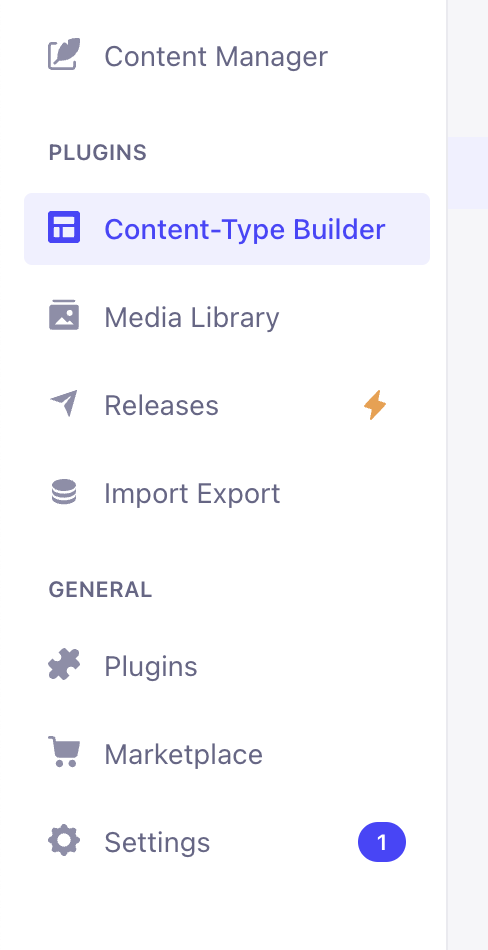

# Control React Native Hot Update with CMS

In a previous post, I introduced the [React Native OTA Hot Update library](https://github.com/vantuan88291/react-native-ota-hot-update), which allows you to self-host a backend for managing hot updates. In this guide, I will walk you through creating a custom CMS using Strapi to control versions and manage hot updates for React Native apps.

## Step 1: Install Strapi

First, install Strapi locally by following the [Strapi Quick Start guide](https://docs.strapi.io/dev-docs/quick-start).

## Step 2: Prepare CMS Structure

To enable OTA updates, design an API in the CMS to filter bundles based on the app version (e.g., 1.0.0, 1.0.1). The app should only receive OTA updates compatible with its version.

1. After successfully installing Strapi, log in to the admin dashboard and navigate to **Content-Type Builder**.
   


2. Create a new collection type for managing bundles:

- Click **Create new collection type** under the **Collection types** section.
  


- Name the collection (e.g., `android` for Android updates):
  


- Add the following fields to the collection, as shown below:
  


3. Repeat the process to create a collection for iOS.

4. Once the collections are created, update their permissions:

- Go to **Settings** > **Users & Permissions plugin** > **Roles** > **Public**.
  
- Grant access to the `android` and `ios` collections:
  


- Click **Save**.

## Step 3: Add Content to Collections

1. In the sidebar, select **Content Manager** and choose `android` or `ios`.

2. Create a new entry and fill in the required fields, including version and bundle file:
   


3. Mark the entry as **Published**:
   


## Step 4: Get Public API Endpoints

Now that the collections are ready, use the following API endpoints to retrieve bundles and versions:

- **Android**: `http://localhost:1337/api/androids?populate=*&filters[targetVersion][$eq]=1.0.0&sort=id:desc`
- **iOS**: `http://localhost:1337/api/ios?populate=*&filters[targetVersion][$eq]=1.0.0&sort=id:desc`

To find the endpoint's **API ID (Plural)**, refer to this section:


The API response structure in TypeScript will look like this:

```typescript
{
    data: {
        id: number;
        documentId: string;
        note: string;
        targetVersion: string;
        enable: boolean;
        required: boolean;
        createdAt: string;
        updatedAt: string;
        publishedAt: string;
        silentMY: boolean;
        silentSG: boolean;
        bundle: {
            id: number;
            documentId: string;
            name: string;
            url: string;
            size: number;
            hash: string;
            mime: string;
            createdAt: string;
            updatedAt: string;
            publishedAt: string;
        };
    }[];
}
```

## Step 5: Add Logic for Version Check and Update in React Native

1. Create a hook called `useUpdateVersion` to check for updates:

  ```typescript
   import React from "react";

// Custom hook to handle OTA updates
export const useUpdateVersion = () => {
  const checkUpdate = async () => {
    // Placeholder for update checking logic
  };

  React.useEffect(() => {
    if (!__DEV__) {
      // Automatically check for updates in production mode
      checkUpdate();
    }
  }, []);
};
   ```

> **Note:** This functionality is disabled in development mode.

2. Define the API endpoint logic in `api.ts`:

    ```typescript
   import axios from "axios";
   import DeviceInfo from "react-native-device-info";
   import { Platform } from "react-native";

   // Function to request the latest OTA bundle from the CMS
   export async function requestUpdateBundle() {
       const endpoint = Platform.OS === 'ios' ? "ios" : "androids";
       const version = DeviceInfo.getVersion(); // Get the current app version
       const response = await axios.get(
           `http://localhost:1337/api/${endpoint}?populate=*&filters[targetVersion][$eq]=${version}&sort=id:desc`
       );
       return response.data;
   }
   ```

3. Implement the update logic in the `checkUpdate` function:

   ```typescript
   import React from "react";
   import HotUpdate from "react-native-ota-hot-update";
   import { requestUpdateBundle } from "./api";
   import { Alert } from "react-native";
   import ReactNativeBlobUtil from "react-native-blob-util";

   // Custom hook to check for and apply OTA updates
   export const useUpdateVersion = () => {
       // Function to start downloading and applying the update bundle
       const startUpdateBundle = (url: string, version: number) => {
           HotUpdate.downloadBundleUri(ReactNativeBlobUtil, url, version, {
               updateSuccess: () => {
                   // Restart the app to apply the update immediately
                   HotUpdate.resetApp();
               },
               updateFail: () => {
                   // Log or show a message for update failure
               },
               restartAfterInstall: true, // Automatically restart the app after installing the update
               progress: (received, total) => {
                   // Update UI to show download progress
               },
           });
       };

       // Function to check for updates by querying the CMS
       const checkUpdate = async () => {
           const bundle = await requestUpdateBundle();
           const currentVersion = await HotUpdate.getCurrentVersion();

           if (bundle?.data?.length) {
               // Filter the latest enabled bundle from the response
               const [itemVersion] = bundle.data.filter(item => item.enable);
               const latestVersion = itemVersion?.id || 0; // Use the bundle ID as the version number

               if (latestVersion > currentVersion) {
                   // Prompt the user to update the app
                   Alert.alert(
                       "New version available!",
                       "A new version has been released. Please update.",
                       [
                           { text: "Cancel", style: "cancel" },
                           {
                               text: "Update",
                               onPress: () =>
                                   startUpdateBundle(
                                       itemVersion?.attributes?.bundle?.data?.attributes?.url,
                                       latestVersion
                                   ),
                           },
                       ]
                   );
               }
           }
       };

       React.useEffect(() => {
           if (!__DEV__) {
               // Automatically check for updates when the app starts in production mode
               checkUpdate();
           }
       }, []);
   };
   ```

## Conclusion

You now have a fully functional CMS for managing React Native OTA updates, complete with admin panel capabilities. Strapi's API also allows integration with CI/CD pipelines for automated content and media uploads, you can refer Strapi's document. Happy coding!

