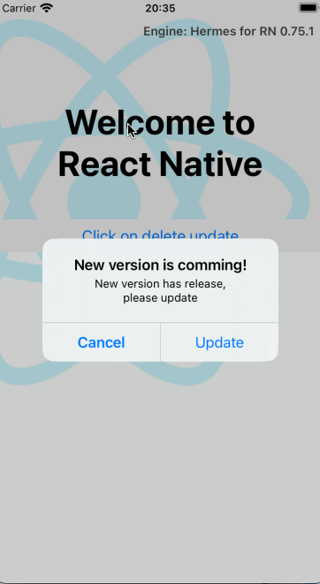
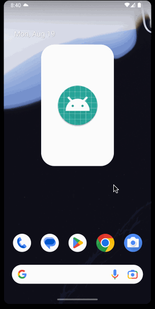
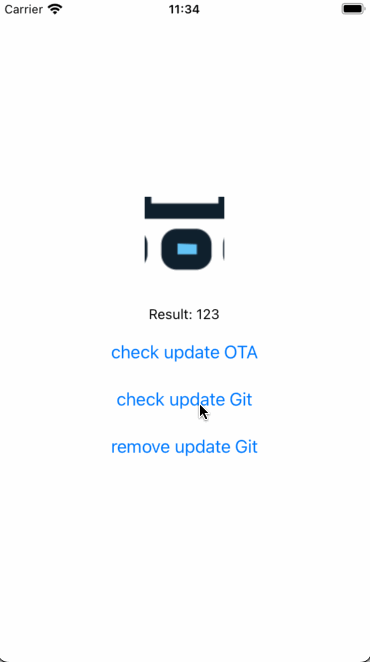

# react-native-ota-hot-update


This React Native module allows you to manage hot updates (in-app update) with minimal configuration, similar to Code Push. You can control versioning and host the JS bundle yourself. The library handles the installation of updates after the bundle is downloaded from your server or Git repository. With Code Push retiring soon, this library gives you full control over your update process, whether hosting the bundle on your own server or in a Git repository.

### Key features:

- Host the bundle on your own server or in a Git repository.
- Rollback function
- Crash Handling: Handles crash exceptions when an incorrect bundle is updated and will automatically roll back to the previous bundle version.

1. **Demo via server**

iOS GIF             | Android GIF
:-------------------------:|:-------------------------:
 | 

2. **Demo via git repository**

iOS GIF             | Android GIF
:-------------------------:|:-------------------------:
 | 

[](https://img.shields.io/npm/dw/react-native-ota-hot-update)
[](https://img.shields.io/npm/v/react-native-ota-hot-update?color=red)

## New architecture supported

New architecture backward compatibility supported from version 2, it also supported old architecture, for source code of version 1.x.x please refer to branch `oldArch`, you might need install version 1.x.x if you are using react native < 0.70

## Installation

if you don't want to manage the download progress, need to install blob util together:

```bash
yarn add react-native-ota-hot-update && yarn add react-native-blob-util
```
Auto linking already, need pod install for ios:
```bash
cd ios && pod install
```

### Expo

Modify `app.json`:

```angular2html
"plugins": [
      "react-native-ota-hot-update",
      ...
    ]
```

### IOS
Open `AppDelegate.m` and add this:

```bash
#import "OtaHotUpdate.h"
...
{
#if DEBUG
  return [[RCTBundleURLProvider sharedSettings] jsBundleURLForBundleRoot:@"index"];
#else
  return [OtaHotUpdate getBundle]; ## add this line
#endif
}
```
### IOS React native 0.77 or above

From react native 0.77, AppDelegate changed to swift file, so the configuration will be change a bit.

Open AppDelegate.swift:

```bash

import react_native_ota_hot_update
...

override func bundleURL() -> URL? {
        #if DEBUG
            RCTBundleURLProvider.sharedSettings().jsBundleURL(forBundleRoot: "index")
        #else
            OtaHotUpdate.getBundle()  // -> Add this line
        #endif
}
```

#### For downloading in background mode on IOS, following this (optional):

AppDelegate.h:
```bash
@property (nonatomic, assign) UIBackgroundTaskIdentifier taskIdentifier;
```
AppDelegate.mm:

```bash
- (void)applicationWillResignActive:(UIApplication *)application {
   if (self.taskIdentifier != UIBackgroundTaskInvalid) {
      [application endBackgroundTask:self.taskIdentifier];
      self.taskIdentifier = UIBackgroundTaskInvalid;
   }

   __weak AppDelegate *weakSelf = self;
   self.taskIdentifier = [application beginBackgroundTaskWithName:nil expirationHandler:^{
      if (weakSelf) {
          [application endBackgroundTask:weakSelf.taskIdentifier];
          weakSelf.taskIdentifier = UIBackgroundTaskInvalid;
      }
   }];
}
```

AppDelegate.swift(RN >= 0.77):

```bash
class AppDelegate: RCTAppDelegate {
var taskIdentifier: UIBackgroundTaskIdentifier = .invalid
...
```
```bash
  public override func applicationDidEnterBackground(_ application: UIApplication) {
    if taskIdentifier != .invalid {
      application.endBackgroundTask(taskIdentifier)
      taskIdentifier = .invalid
    }

    taskIdentifier = application.beginBackgroundTask(withName: "OTAUpdate") { [weak self] in
      if let strongSelf = self {
        application.endBackgroundTask(strongSelf.taskIdentifier)
        strongSelf.taskIdentifier = .invalid
      }
    }
  }

  public override func applicationWillEnterForeground(_ application: UIApplication) {
    if taskIdentifier != .invalid {
      application.endBackgroundTask(taskIdentifier)
      taskIdentifier = .invalid
    }
  }
```


### Android
Open `MainApplication.kt` and add these codes bellow:
```bash
import com.otahotupdate.OtaHotUpdate
...
override val reactNativeHost: ReactNativeHost =
  object : DefaultReactNativeHost(this) {
    ...
    override fun getJSBundleFile(): String? {
      return OtaHotUpdate.bundleJS(this@MainApplication)
    }
    ...
  }

```

MainApplication.java:
```bash
		@Nullable
		@Override
		protected String getJSBundleFile() {
			return OtaHotUpdate.getBundleJS(this);
		}
```

For java it maybe can be like: `OtaHotUpdate.Companion.getBundleJS(this)` depend on kotlin / jdk version on your project, you can use android studio to get the correct format coding.

If want to remove bundle wrong handler, pass false param in getBundleJS like this:

```aiignore
return OtaHotUpdate.bundleJS(this@MainApplication, false)

```

Open `AndroidManifest.xml` :

`<uses-permission android:name="android.permission.READ_EXTERNAL_STORAGE" />`

`<application
...
android:requestLegacyExternalStorage="true"
`

## That's it, can check the example code
`Remember hot update just work at release mode, debug mode won't working`


### Control Hot Update via Server
With this method, you can host the bundle JS on your own server. The app fetches the updates directly from the server, allowing for dynamic updates.

For detailed instructions on how to implement this, refer to [**DOC_OTA_SERVER.md**](DOC_OTA_SERVER.md).

---

### Control Hot Update via Git Repository
This method allows you to use a Git repository to host the bundle JS. The app pulls updates directly from the repository, providing an easy and version-controlled way to manage updates.

For detailed instructions on how to implement this, refer to [**DOC_OTA_GIT.md**](DOC_OTA_GIT.md).


### Build a Custom Admin Panel with CMS
Using Strapi, you can build a tailored admin panel to manage React Native hot updates effectively. This approach allows you to centralize the control of versioning and OTA updates while providing a user-friendly interface for managing content. To get started, refer to the detailed steps and code examples in this guide. For additional details, see [**OTA_CMS.md**](OTA_CMS.md).


## License

[MIT](LICENSE)


### Sponsor this project
https://paypal.me/vantuan88291
